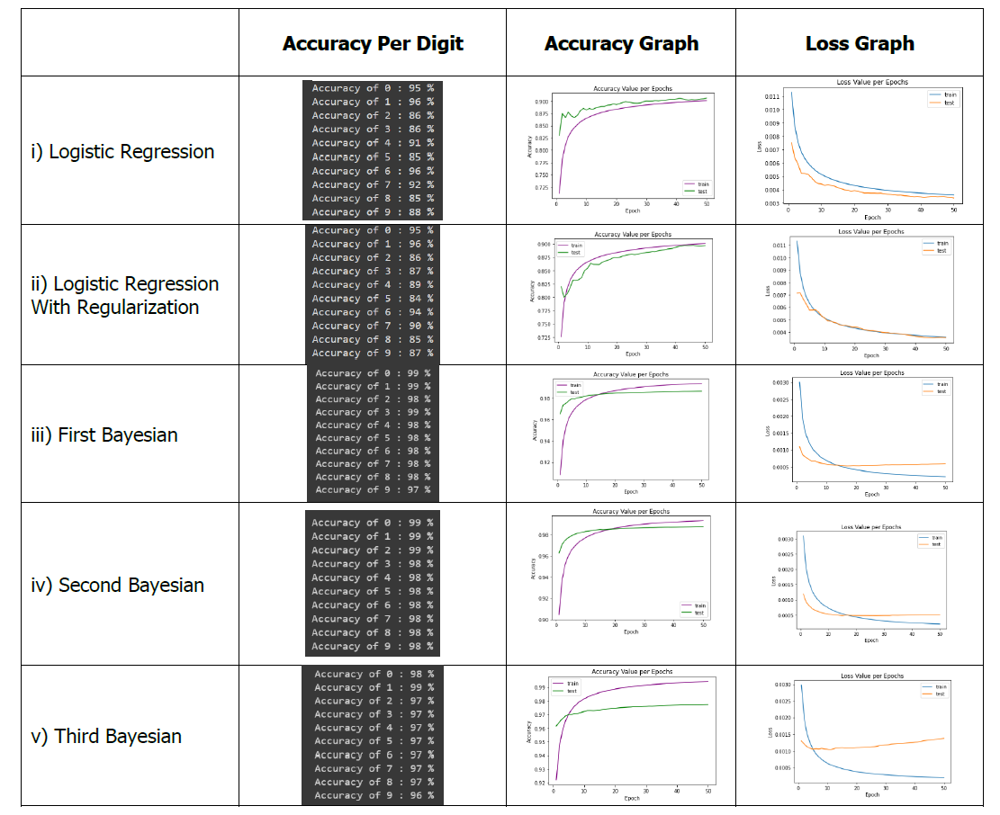

# MNIST_LogReg_BayesNN

This project focuses on implementing and comparing various models on the MNIST dataset, including logistic regression, logistic regression with L2 regularization, and Bayesian neural networks with different modifications. The goal is to analyze the differences between these models both theoretically and practically.

## Implementation

### Background: 

#### Bayesian Neural Networks

Bayesian Neural Networks (BNNs) extend traditional neural networks by treating model parameters as probability distributions rather than fixed values. This allows BNNs to capture uncertainty in predictions, crucial for robust decision-making. BNNs use techniques like Monte Carlo dropout or variational inference to approximate posterior distributions over parameters. These distributions quantify the model's uncertainty, providing richer insights into predictions. BNNs find applications in scenarios where uncertainty awareness is essential, such as in safety-critical systems, decision-making under uncertainty, and handling limited or noisy data.

#### Logistic Regression
Logistic Regression is a linear classification algorithm that models the probability of belonging to a particular class. It uses the logistic function to transform a linear combination of features into probabilities.For multiclass classification, one-vs-all (OvA) or one-vs-one (OvO) strategies can be employed.In this project, I used which trains a separate binary classifier for each class. The class with the highest probability or votes is then assigned as the final prediction.

### The models:

All five models were trained for 50 epochs with a batch size of 100.

Models i and ii represent logistic regression and logistic regression with regularization, utilizing Cross Entropy loss and trained with Stochastic Gradient Descent.

Model iii is a Bayesian model featuring 2 convolutional layers followed by 3 linear layers, employing CE loss and Adam optimizer.

Model iv is a Bayesian model with 2 convolutional and 2 linear layers, utilizing CE loss and Adam optimizer.

Model v, a Bayesian model, consists of 2 linear layers with no convolutional layers, utilizing CE loss and Adam optimizer.

### The Dataset
MNIST (Modified National Institute of Standards and Technology) is a widely used dataset in the field of machine learning and computer vision. It consists of a collection of 28x28 pixel grayscale images of handwritten digits (0 through 9). The dataset is commonly used for training and testing classification algorithms. MNIST serves as a benchmark for evaluating the performance of various machine learning models, particularly for image recognition tasks.

### Loss Function

The softmax cross-entropy loss function is commonly employed to measure the dissimilarity between the true labels $\(y\)$ and the predicted probabilities $\(\hat{y}\)$ in a classification task. Unlike regular cross-entropy, softmax cross-entropy includes a softmax activation function, which is applied to the model's raw output to obtain probability distributions over the classes. The softmax function ensures that the predicted probabilities sum to 1, making them interpretable as class probabilities.

In PyTorch's `torch.nn` library, the cross-entropy loss is often implemented with softmax. Specifically, the `torch.nn.CrossEntropyLoss` automatically incorporates the softmax function into its computation. This means that when using this loss function, there is no need to explicitly apply a softmax activation to the model's output before calculating the loss.

For each sample in a batch, softmax cross-entropy sums the negative logarithm of the predicted probability assigned to the correct class. The overall loss is then computed as the average across all samples in the batch. This formulation effectively penalizes the model more when its predictions deviate from the true labels, thereby encouraging accurate classification.

The softmax cross-entropy loss formula is given by:

$L(y, \hat {y}) = { -\frac{1}{N} \sum\limits_{i=1}^{N} \sum\limits_{j=1}^{C} y_{i,j} \log(\frac{ e^ {\hat{y_{i,j}}}} {\sum\limits_{k=1}^{C} e^{\hat{y_{i,k}}} }) }$

Where,

- $N {\text{ :The number of elements in the input or the batch size}}$
- $C {\text{ :The number of classes}}$
- $y_{i,j} {\text{ :The true output for the i-th sample and j-th class}}$
- $\hat{y_{i,j}} {\text{ :The predicted output for the i-th sample and j-th class}}$

### Optimization Step

#### SGD (used for logistic regression)
Stochastic Gradient Descent (SGD) is an iterative optimization algorithm widely used for training machine learning models, especially in the context of large datasets. It is a variant of the gradient descent algorithm, designed to handle large amounts of data more efficiently.

In each iteration of SGD, a random subset or a single data point (hence the term "stochastic") is sampled from the entire dataset. The algorithm then updates the model parameters based on the gradient of the loss function with respect to those parameters. This process is repeated for a fixed number of iterations (epochs) or until convergence.

- $\text{Parameters Initialization: } {\theta^{(0)}}$

- $\text{For } { t = 0, 1, 2, \ldots, \text{until convergence:} }$

  - $\theta_{t+1} = \theta_t - \eta \nabla f(\theta_t, x_i, y_i)$

Where,

- $\theta_{t+1}: {\text{Updated parameter vector at iteration } (t+1).}$
- $\theta_t: {\text{Current parameter vector at iteration } t.}$
- $\eta: {\text{Learning rate, determining the step size in the parameter space.}}$
- $\nabla f(\theta_t, x_i, y_i): {\text{Gradient of the loss function } f \text{ with respect to } \theta_t \text{ for the training example } (x_i, y_i). \text{ It indicates the direction to adjust the parameters for minimizing the loss.}}$

#### Adam Optimizer (used for Bayesian NN)

ADAM (Adaptive Moment Estimation) is a popular optimization algorithm for training deep neural networks. It combines momentum and RMSprop, adapting learning rates for each parameter. Efficient and effective, it mitigates issues like vanishing/exploding gradients, contributing to improved training in deep learning tasks.

$\theta_{t+1} = \theta_t - \frac{\alpha}{\sqrt{\hat{v}_t} + \epsilon} \cdot \hat{m}_t $

Where,

- $\theta_t{\text{: Parameters at time step \ t \}}$
- $\alpha{\text{: Learning Rate}}$
- $\hat{m}_t{\text{: Biased first moment estimate}}$
- $\hat{v}_t{\text{: Biased second raw moment estimat}}$
- $\epsilon{\text{: Small constant to prevent division by zero}}$

## Results
The logistic regression model with regularization achieves better accuracy, aiming to prevent overfitting on the data, keeping the weights relatively low to avoid exploding gradients. Notably, the test set's loss is more stable, and the model performs better with regularization.

In Bayesian models, Model iii stands out with superior results due to its use of convolutional layers and more linear layers, enabling better data learning and generalization on the test set. The difference lies in the distribution functions associated with weights and biases in Bayesian models, providing uncertainty for each output.

Logistic regression is a binary classification algorithm that computes the probability of a vector input belonging to a specific class. Bayesian models (iii-iv) exhibit relatively close results in terms of both loss and accuracy, as they approach the decision speed of logistic regression. However, Model v, consisting of only 2 linear layers, shows less favorable outcomes, indicating a less effective generalization, with a higher average loss.

